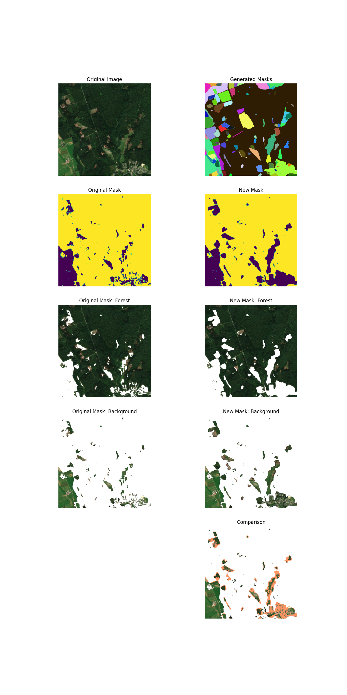
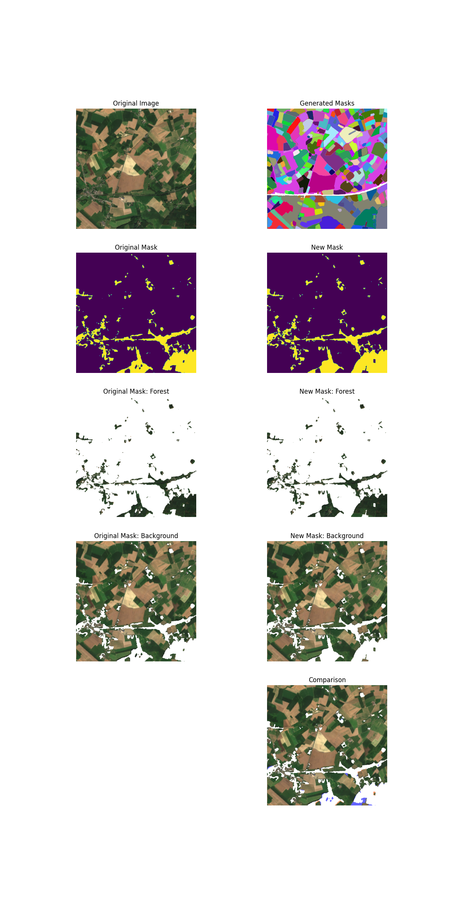

# Using SAM to improve land cover masks

Many land cover maps are not perfect and contain some errors. The following module used SAM (Segment Anything model) to create a better land cover mask.

Module `improve_mask.py` contains class `SamMaskGenerator`. This class encapsulates the SAM model and provides methods to improve a land cover mask of two classes -> 0 background, 1 foregound. 

The algorithm :
1. Blobs <- get blobs segmented from original RGB image using SAM 
1. Surrounding <- Blob's foreground surrounding ratio
1. FgRatio <- ratio of foreground pixels in Blob
1. Remove foreground pixels from original mask
    - IF Surrounding >= $S_1$ AND FgRatio >= $S_2$ -> remove blob from mask 
1. Add foreground pixels to original mask
    - IF Surrounding <= $S_3$ AND FgRatio <= $S_4$ -> add blob to mask

where $S_1$ = `sub_min_surrounding`, $S_2$ = `sub_min_bkg`, $S_3$ = `add_max_surrounding`, $S_4$ = `add_max_bkg`

**Note**: We strongly advise to use only the *Subtraction* part of the algorithm. This ensures that we in the worst case produce some FN but no FP. The *Addition* part of the algorithm is more risky and can produce FP.

### Example

```python
mask_generator = SamMaskGenerator(
    model_type=TYPE_H,
    ckpt_path=SAM_H_CKPT,
    sub_min_surrounding=0.8,
    sub_min_bkg=0.3,
    add_max_surrounding=-1,
    add_max_bkg=0,
    max_area=512**2 * 0.05,
    sigma=2,
    surrounding_mode='canny',
    device='cuda'
) 

for idx in tqdm.tqdm(range(1,3124)):
    
    image, mask = load_image_mask(idx,DATA_PATH)

    new_mask = mask_generator.process_image(image, mask)

    new_mask = new_mask.astype(np.uint8)
    
    tifffile.imwrite(f'{OUTPUT_PATH}/mask_{idx:04}.tif', new_mask) 
```

### Results

#### Subtraction



#### Addition

- example of possible FP


