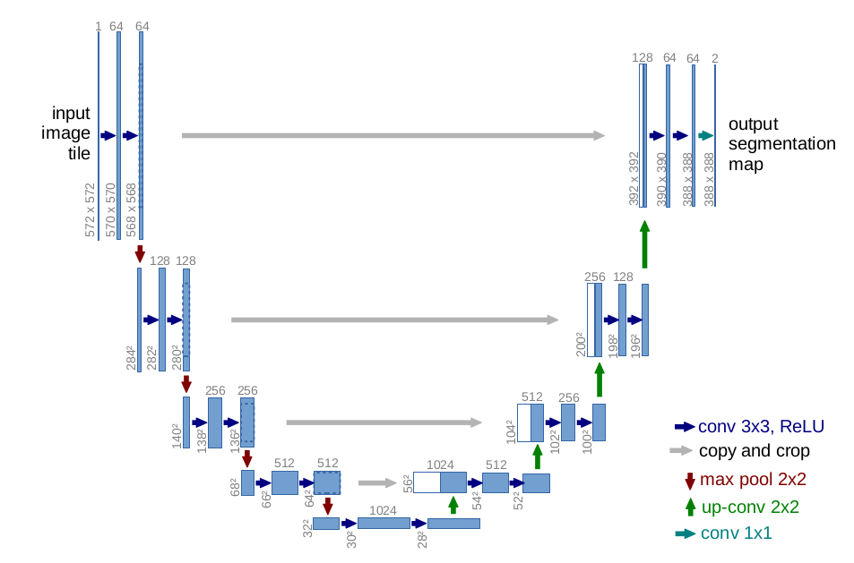

# Datasets

- [BigEarthNet](https://bigearth.net/)
    - 590,326 Sentinel-2 image patches
- [SEN12MS + DFC2020](https://ieee-dataport.org/competitions/2020-ieee-grss-data-fusion-contest#files)
    - low resolution SEN12MS dataset (original for training in the competition) using [MODIS](https://lpdaac.usgs.gov/products/mcd12q1v061/) land cover data
    - high resolution DFC2020 dataset (for testing in the competition)
- [SSL4EO-S12](https://paperswithcode.com/paper/ssl4eo-s12-a-large-scale-multi-modal-multi)([citation](./bibliography.md#ssl4eo-s12-a-large-scale-multi-modal-multi-temporal-dataset-for-self-supervised-learning-in-earth-observation))
    - dataset for self-supervised pretraining containing unlabeled data
    - pretrained models including MoCo-v2, DINO, MAE, data2vec
    - pretrained models perfomed better than their supervised counterparts

# Articles

- [Network architectures for semanantic segmentation](#network-architectures-for-semanantic-segmentation)
    - [FCN](#fully-convolutional-networks-for-semantic-segmentation)
    - [Unet](#u-net-convolutional-networks-for-biomedical-image-segmentation)
    - [DeepLab](#semantic-image-segmentation-with-deep-convolutional-nets-and-fully-connected-crfs)
    - [DeepLabV3+](#encoder-decoder-with-atrous-separable-convolution-for-semantic-image-segmentation)
    - [Swin Transformer](#swin-transformer-hierarchical-vision-transformer-using-shifted-windows)
    - [SAM](#segment-anything)
    - [MoCo (Momentum Contrast)](#momentum-contrast-for-unsupervised-visual-representation-learning)

- [Survey papers](#survey-papers)
    - [Self-supervised Learning in Remote Sensing: A review](#self-supervised-learning-in-remote-sensing-a-review-linkcitation)

&nbsp;
- [Applications](#applications)
    - [Weakly supervised semantic segmentation of satellite images for land cover mapping - challenges and opportunites](#weakly-supervised-semantic-segmentation-of-satellite-images-for-land-cover-mapping---challenges-and-opportunities)
    - [Satellite Image Semantic Segmentation](#satellite-image-semantic-segmentation)
    - [Satellite Image Segmentation Using Deep Learning for Deforestation Detection](#satellite-image-segmentation-using-deep-learning-for-deforestation-detection)
    - [Semantic segmentation of slums in satellite images using transfer learning on fully convolutional neural networks](#semantic-segmentation-of-slums-in-satellite-images-using-transfer-learning-on-fully-convolutional-neural-networks)
    - [Forest monitoring in guatemala using satellite imagery and deep learning](#forest-monitoring-in-guatemala-using-satellite-imagery-and-deep-learning)
    - [Forest Segmentation with Spatial Pyramid Pooling Modules: A Surveillance System Based on Satellite Images](#forest-segmentation-with-spatial-pyramid-pooling-modules-a-surveillance-system-based-on-satellite-images)
    - [Global land use / land cover with Sentinel 2 and deep learning](#global-land-use--land-cover-with-sentinel-2-and-deep-learning)
    - [Efficient Deep Semantic Segmentation for Land Cover Classification Using Sentinel Imagery](#efficient-deep-semantic-segmentation-for-land-cover-classification-using-sentinel-imagery)
    - [Self-supervised Vision Transformers for Land-cover Segmentation and Classification](#self-supervised-vision-transformers-for-land-cover-segmentation-and-classification)
    - [Double-Step U-Net: A Deep Learning-Based Approach for the Estimation of Wildfire Damage Severity trhough Sentine-2 Satellite Data](#double-step-u-net-a-deep-learning-based-approach-for-the-estimation-of-wildfire-damage-severity-trhough-sentine-2-satellite-data)
    - [Superpixel-Based Attention Graph Neural Network for Semantic Segmentation in Areal Images](#superpixel-based-attentio0n-graph-neural-network-for-semantic-segmentation-in-aerial-images-linkcitation)

## Network architectures for semanantic segmentation

### Benchmarking and scaling of deep learning models for land cover image classification([link](https://www.sciencedirect.com/science/article/pii/S0924271622003057)/[citation](./bibliography.md#benchmarking-and-scaling-of-deep-learning-models-for-land-cover-image-classification))

- BigEarthNet dataset
- 19 LULC classes
- Tested multiple architectures:
- ResNet
- VGG
- ViT
- MLPMixes (not the worst performace + low number of parameters)
- CNN
- WRN (wide residual network) + EfficientNet with attention (best performance)
### Fully Convolutional Networks for Semantic Segmentation ([link ](https://openaccess.thecvf.com/content_cvpr_2015/html/Long_Fully_Convolutional_Networks_2015_CVPR_paper.html)/[citation](./bibliography.md#fully-convolutional-networks-for-semantic-segmentation))

- Fully Convolutional network for pixel-vise semantic segmentation from CNN for image classification
- Uses modified CNN for image classification like ImageNet, LeNet, GoogleNet - in the final experiments VGG-16 layer net used
- Introduced **updampling convolution** - using bilinear convolution with learnable parameters (to be able to learn nonlinear upsampling)
- 1x1 convolution added to cast the output to the number of channels identical to the number of segmentation classes
- Added skipped connections to address the issue of low details

Skipped connections are used to preserve more information about details in the image in output (large upsampling strides tends to loose information about small details in the input image)

### U-Net: Convolutional Networks for Biomedical Image Segmentation
 ([link](https://link.springer.com/chapter/10.1007/978-3-319-24574-4_28)/[citation](./bibliography.md#u-net:-convolutional-networks-for-biomedical-image-segmentation))

- Full CNN network reminding U-shape
- Output is the same size as image containing one output channel for one segmentation class
- Uses down and upsampling blocks
- Do not use padding in convolutions rather it mirrors the image around the edges.

### Semantic image segmentation with deep convolutional nets and fully connected CRFs
 ([link](https://arxiv.org/abs/1412.7062)/[citation](./bibliography.md#semantic-image-segmentation-with-deep-convolutional-nets-and-fully-connected-crfs))

- Use of **atrous algorithm** or altrous convolution.

Basic convolution can be computed as:

$$I \star K (i) =  \sum_{-\Delta < a < \Delta} I(i+a)K(i) $$

Astrous convolution can be written as:

$$I \star K (i) =  \sum_{-\Delta < a < \Delta} I(i+\mathbf{r} a)K(i) $$

where $\mathbf{r}$ is the rate parameter or initial stride. It represents how many pixels in the original image are skipped between each pixel of the kernel.

It is used to broater the field of view quicker without increasing the number of parameters.

This helped to reduce number of parameters and widen the field of view so keep information about local details.

- **CRF** Conditional random fields - to smooth noisy segmentation maps. Pixels class is assigned based on the assigned probability to itself and to its neighbors (close in space, close in color). Model employs the enrgy function

$$
E(x)=\sum_{i}\theta_{i}(x_{i})+\sum_{i j}\theta_{i j}(x_{i},x_{j})
$$

$$
w_{1}\exp\left(-\,{\frac{||p_{i}-p_{j}||^{2}}{2\sigma_{\alpha}^{2}}}-{\frac{||I_{i}-I_{j}||^{2}}{2\sigma_{\beta}^{2}}}\right)+w_{2}\exp\left(-\,{\frac{||p_{i}-p_{j}||^{2}}{2\sigma_{\gamma}^{2}}}\right)
$$

where $p$ is the position, $I$ is color (RGB) vector and $\sigma$ are hyper parameters.
### Encoder-Decoder with Atrous Separable Convolution for Semantic Image Segmentation
 ([link](https://openaccess.thecvf.com/content_ECCV_2018/html/Liang-Chieh_Chen_Encoder-Decoder_with_Atrous_ECCV_2018_paper.html)/[citation](./bibliography.md#encoder-decoder-with-atrous-separable-convolution-for-semantic-image-segmentation))

- Encoder-Decoder architecture for better reconstruction
- Xception network with depthwise-separable convolutions (convolution is done by channels separatly and processed by 1x1 convolution at the end to reduce number of computations)
- atrous separable convolutions
- resulting model is faster and stronger on PASCAL VOC2012 dataset than state of the art

### Swin Transformer: Hierarchical Vision Transformer using Shifted Windows
 ([link](https://openaccess.thecvf.com/content/ICCV2021/html/Liu_Swin_Transformer_Hierarchical_Vision_Transformer_Using_Shifted_Windows_ICCV_2021_paper)/[citation](./bibliography.md#swin-transformer:-hierarchical-vision-transformer-using-shifted-windows))

- Transformer achitecture adapted on vision tasks to become an universal backbone architecture
- Introduced:
- Hierarchical feature maps by merging patches (in contrast to ViT - Visual transformer)
- Shifted Windows approach for computing self attention -> every other block shifftes patches from previous block to get overlaps

- State of the art performance on various computer vision tasks including semantic segmentation

### Segment Anything
 ([link](hhttps://arxiv.org/abs/2304.02643)/[citation](./bibliography.md#segment-anything))

- Promt based segmentation
- trained with over 1 billion masks
- Promts:
- Point
- Box
- Mask
- Free-form text
- Model:
- Image encoder - pretrained ViT
- Prompt encoder - point and boxes (position embedding), masks (cnn + sum)m text (off-the-shelf from CLIP)

- Aplications:
- Zero-shot Transfer learning
- Zero-shot Edge detection
- Zero-shot Instance segmentation
- Automatic labeling system
- Publicly available pretained version

## Survey papers

### Self-supervised Learning in Remote Sensing: A review ([link](https://paperswithcode.com/paper/self-supervised-learning-in-remote-sensing-a)/[citation](./bibliography.md#self-supervised-learning-in-remote-sensing-a-review))

- Review of self-supervised learning methods usable in remote sensing

    

- Comparison of deep learning models on banchmark datasets

    

## Applications

### Momentum Contrast for Unsupervised Visual Representation Learning ([link](https://arxiv.org/abs/1911.05722)/[citation](./bibliography.md#momentum-contrast-for-unsupervised-visual-representation-learning) )

- Momentum Contrast (MoCo)
- V3 current leader on BigEarthNet dataset
- Contrastive loss for unsupervised learning
- Encoder computes a query and another a key, query should be similar to ist key and dissimilar to other keys.
- Queue of old keys is stored to compute the loss
- Key encoder is updated with momentum of the query encoder weights
- pseudo code:

### Weakly supervised semantic segmentation of satellite images for land cover mapping - challenges and opportunities
 ([link](https://arxiv.org/abs/2002.08254)/[citation](./bibliography.md#weakly-supervised-semantic-segmentation-of-satellite-images-for-land-cover-mapping---challenges-and-opportunities))

- *Implemented by previous intern*
- Use of low-resolution training data to train a model for high-resolution data
- Several models trained -> Unet, DeepLabV3+

### Satellite Image Semantic Segmentation
 ([link](https://arxiv.org/abs/2110.05812)/[citation](./bibliography.md#satellite-image-semantic-segmentation))

- Uses Swin Transformer - Using **S**hifted **WIN**dows makes it robust against scala variability
- 6 classes :
- sparse forest
- dense forest
- moor
- herbaceous formation
- biulding
- road
- open data IGN <a href="https://geoservices.ign.fr/telechargement">test</a>
- BD Ortho for the satellite images
- BD Foret v2 for vegetation data
- <a href="https://github.com/koechslin/Swin-Transformer-Semantic-Segmentation">Github repository</a>

### Satellite Image Segmentation Using Deep Learning for Deforestation Detection
 ([link](https://ieeexplore.ieee.org/abstract/document/9575783/)/[citation](./bibliography.md#satellite-image-segmentation-using-deep-learning-for-deforestation-detection))

- Dataset - 322 Images 512 x 512, PyAutoGiu + Google Earth
- Classes:
- Forest
- Deforestation
- Other
- Traversky + Dice Loss weighted -> deforestation is the most important class
- IOU metric
- standard U-Net architecture

### Semantic segmentation of slums in satellite images using transfer learning on fully convolutional neural networks
 ([link](https://www.sciencedirect.com/science/article/pii/S0924271619300383)/[citation](./bibliography.md#semantic-segmentation-of-slums-in-satellite-images-using-transfer-learning-on-fully-convolutional-neural-networks))

- transfer learning for FCNN - pretrained on ImageNet and QuickBird (satellite imagery)
- VGG19 - classification layer is replaced with 1x1 convolutions for correct number of output channels following upsampling layers

- satellite images
- QiuckBird
- Sentinel 2
- TerraSAR-X

- transfer learning to similar types of images (satellite images) helped -> QuickBird to Sentinel 2

### Forest monitoring in guatemala using satellite imagery and deep learning
 ([link](https://ieeexplore.ieee.org/abstract/document/8899782)/[citation](./bibliography.md#forest-monitoring-in-guatemala-using-satellite-imagery-and-deep-learning))

- Sentinel 2 data for training and high resolution Digital Globe + Planet platforms for validation
- Shallow U shaped CNN to predict difference between images
- No evaluation yet

### Forest Segmentation with Spatial Pyramid Pooling Modules: A Surveillance System Based on Satellite Images
 ([link](https://www.mdpi.com/1999-4907/14/2/405)/[citation](./bibliography.md#forest-segmentation-with-spatial-pyramid-pooling-modules:-a-surveillance-system-based-on-satellite-images))

- Pretrained Unet as backbone
- Spatial Pyramid Pooling added
- authors report good porformance

### Global land use / land cover with Sentinel 2 and deep learning
 ([link](https://ieeexplore.ieee.org/abstract/document/9553499)/[citation](./bibliography.md#global-land-use-/-land-cover-with-sentinel-2-and-deep-learning))

- Unet trained from scratch
- Sentinel 2 -> 6 bands
- 10 classes (including trees)
- Tested on Belgium region

### Efficient Deep Semantic Segmentation for Land Cover Classification Using Sentinel Imagery
 ([link](https://www.mdpi.com/2072-4292/15/8/2027)/[citation](./bibliography.md#efficient-deep-semantic-segmentation-for-land-cover-classification-using-sentinel-imagery))

- U-TAE model $\rightarrow$ based on lighweight temporal encoder transformer (LTAE) with Unet architecture with modification
- instead of temporal attention a channel attention is used by switching input channels
- Combination of Sentinel 1 and Sentinel 2 data
- Outperforms other models with very low computational cost (better in details)
- Experiments with the number of input parameters , (ndvi, ndbi, ndwi)
- including class Trees

### Self-supervised Vision Transformers for Land-cover Segmentation and Classification
 ([link](https://openaccess.thecvf.com/content/CVPR2022W/EarthVision/html/Scheibenreif_Self-Supervised_Vision_Transformers_for_Land-Cover_Segmentation_and_Classification_CVPRW_2022_paper.html)/[citation](./bibliography.md#self-supervised-vision-transformers-for-land-cover-segmentation-and-classification))

- Self-supervised learning using **contrastive** learning -> to embed different images appart from each other and similar closer
- Using Sentinel 1 and Sentinel 2 imagery
- Swin Transformer + U net architecture

### Deep Learning in the Mapping of Agricultural LandUse Using Sentinel-2 Satellite Data
 ([link](https://www.mdpi.com/2673-7086/2/4/42)/[citation](./bibliography.md#deep-learning-in-the-mapping-of-agricultural-landuse-using-sentinel-2-satellite-data))

- using Unet for segmentation
- Sentinel 2 data

### Double-Step U-Net: A Deep Learning-Based Approach for the Estimation of Wildfire Damage Severity trhough Sentine-2 Satellite Data
 ([link](https://www.mdpi.com/2076-3417/10/12/4332)/[citation](./bibliography.md#double-step-u-net:-a-deep-learning-based-approach-for-the-estimation-of-wildfire-damage-severity-trhough-sentine-2-satellite-data))

- Architecture containing 2 separate U-net models
- first one for segmentation of the burned area
- second one for classification of the burned area into 4 classes of severity (negligible, low, medium, high, complete destruction)

### Superpixel-Based Attentio0n Graph Neural Network for Semantic Segmentation in Aerial Images ([link](https://www.mdpi.com/2072-4292/14/2/305)/[citation](./bibliography.md#superpixel-based-attention-graph-neural-network-for-semantic-segmentation-in-areal-images))

- Graph neural network
- Modules:
    - superpixel extraction using SLIC (Simple Linear Iterative Clustering)
    - Feature extraction using CNN
    - GANN (Graph Attention Neural Network) - graph neural network
    - Prediction (upsampling) - no imlementation details
- Graph construction:
    - nodes are superpixels
    - edges are constructed using K nearest neighbors
    - node features are (average RGB, x, y, feature vector)
- on some datasets performs better than DeepLabV3+
- no code available

### SA2-Net: Scale-aware Attention Network for Microscopic Image Segmentation ([link](https://paperswithcode.com/paper/sa2-net-scale-aware-attention-network-for)/[citation](./bibliography.md#sa2-net-scale-aware-attention-network-for-microscopic-image-segmentation))

- Semantic segmentation of medical images the primary focus is precise segmentation of cells boundaries
- CNN bad for distante dependencies and Transformer bad for local dependencies -> Scale-aware attention modules (SA2)
- Unet structure
    - SA2 modules instead of skip connections
    - Adaptive up-attention (AuA) modules used in upscaling to merge skip connections and upsampled features
    - Deep supervision was used to improve the performance

#### SA2 module

1. features at each scale are preprocesed by Local Scale Attentio (LSA) (with depthwise convolution).

2. Attention weights between scales are computed.
   $$Q = \text{Concat}(\hat{F}^1, \hat{F}^2, \hat{F}^3, \hat{F}^4) $$
   $$\{w^1, w^2, w^3, w^4\} = \text{Conv}(Q)$$
   $$\hat{W} = \text{GeLU}(\text{Conv}(Q))$$
   $$ \overline{F}^i = w^i \odot (\hat{F}^i \odot \hat{W})$$

   Following MLP and conv to produce output

3. Adaptive up-attention module
    - takes input from previout stage $P^{i-1}$ and scale-awere attended $O^i$ 
    - process desribed in the image
    - output is compared to the goud truth using deep supervision, during training
