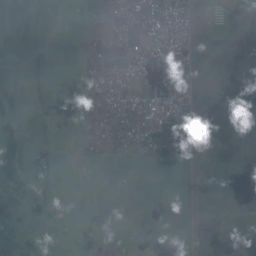
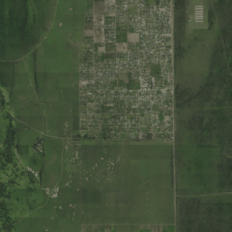
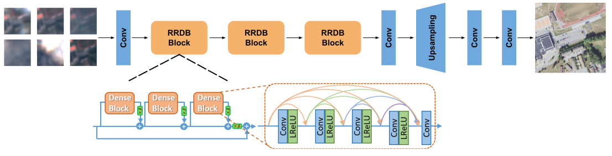

# Super Resolution

This module uses the [Satlas-super-resolution](https://satlas.allen.ai) pretrained models to generate super resolution images from Sentinel-2 imagery.

## Satlas-super-resolution

[Satlas Website](https://satlas.allen.ai) | [Github](https://github.com/allenai/satlas-super-resolution)

Satlas aims to provide open AI-generated geospatial data that is highly accurate, available globally, 
and updated on a frequent (monthly) basis. One of the data applications in Satlas is globally generated 
**Super-Resolution** imagery for 2023. 

This repository contains the training and inference code for the AI-generated Super-Resolution data found at 
https://satlas.allen.ai.

<p align="center">
   
   
</p>

## Download

### Model Weights
The weights for our models, with varying number of Sentinel-2 images as input are available for download at these links:
- [2-S2-images](https://pub-956f3eb0f5974f37b9228e0a62f449bf.r2.dev/satlas_explorer_datasets/super_resolution_models/esrgan_orig_2S2.pth)
- [6-S2-images](https://pub-956f3eb0f5974f37b9228e0a62f449bf.r2.dev/satlas_explorer_datasets/super_resolution_models/esrgan_orig_6S2.pth)
- [12-S2-images](https://pub-956f3eb0f5974f37b9228e0a62f449bf.r2.dev/satlas_explorer_datasets/super_resolution_models/esrgan_orig_12S2.pth)
- [18-S2-images](https://pub-956f3eb0f5974f37b9228e0a62f449bf.r2.dev/satlas_explorer_datasets/super_resolution_models/esrgan_orig_18S2.pth)


## Model
Our model is an adaptation of [ESRGAN](https://arxiv.org/abs/1809.00219), with changes that allow the input to be a time
series of Sentinel-2 images. All models are trained to upsample by a factor of 4. 

<p align="center">
   
</p>

## Usage

Python script `SR.py` performes the super-resolution of Sentinel-2 images using SATLAS-SR. Input data are created using script `download_sentinel/download_data_for_satlas_SR.py`. Script is utilizing lazy evaluation for RAM efficiency. Individual images are processes sequentialy.

### Output files

```
<output-dir>
├── sr<n-s2-images>_image_<series-idx>_<row>_<col>.png // if the SR image is larger than output_size, it is split into multiple images
└── sr<n-s2-images>_image_<series-idx>.png // SR image has output size
```
***Note**: Indices start from 1.

### Parameters

```text
Script for creating Super-Resolution images of Sentinel-2 images using SATLAS-SR. Resulting image is in 4x resolution of the input image (10m/px ->
2.5m/px). Source: https://github.com/allenai/satlas-super-resolution

options:
  -h, --help            show this help message and exit
  -i INPUT_DIR, --input-dir INPUT_DIR
                        Path to the directory containing series of images (image_x_y.tif).
  -o OUTPUT_DIR, --output-dir OUTPUT_DIR
                        Path to the directory where the output images will be saved.
  -n N_S2_IMAGES, --n-s2-images N_S2_IMAGES
                        Number of Sentinel-2 images in the series for SATLAS-SR.
  -w WEIGHTS_PATH, --weights-path WEIGHTS_PATH
                        Path to the model weights .pth file.
  --output-size OUTPUT_SIZE
                        Size of the output image / images (if the SR image is larger than output_size).
  --patch-size PATCH_SIZE
                        Size of the intermediate patches.
  --patch-offset PATCH_OFFSET
                        Offset of the intermediate patches to avoid border effects on final image.
  --original-size ORIGINAL_SIZE
                        Size of the original image.
  --device DEVICE       Device to use for inference.
  --offset OFFSET       Offset of the series to start from.
  --end END             Index of the last series to process.
```