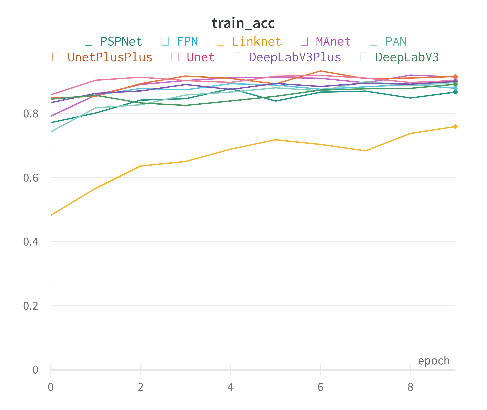
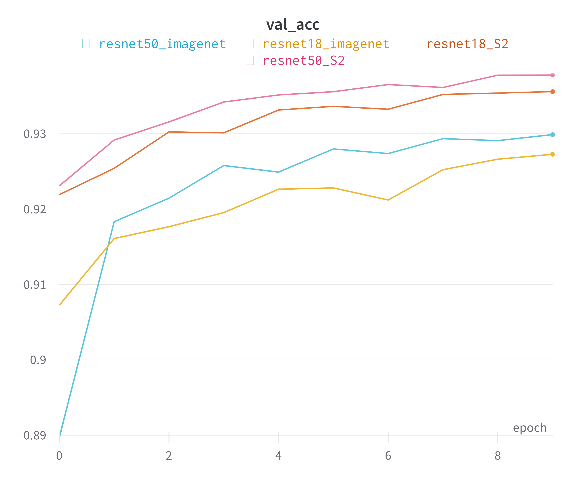
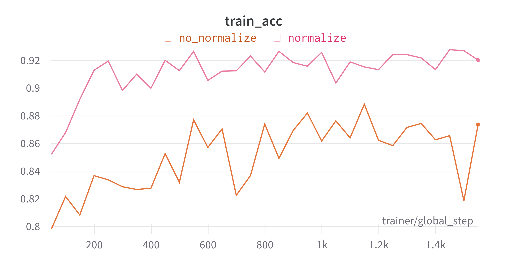
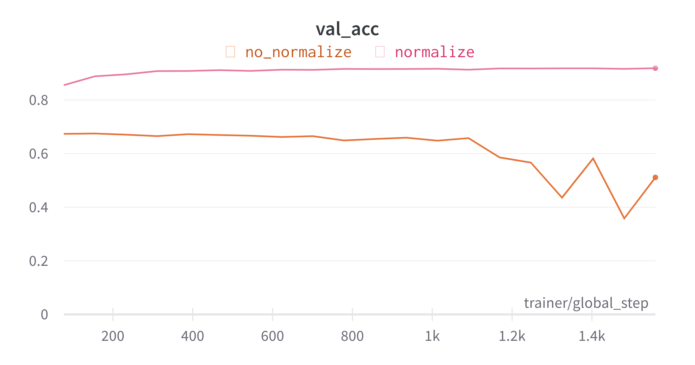
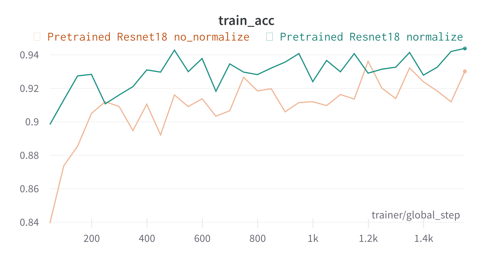
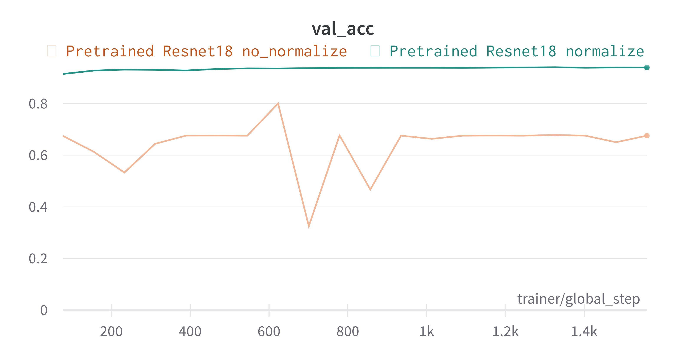

# Experiments

## 1. Experiment - Different network architectures

- mobilnet backbone
- trained for 10 epochs
- one season dataset

### Results

Most of the models are training in the save fashion except for the 'LinkNet' with slow start.

Results in [experiment1.csv](../../md_assets/experiments/experiment1.csv)

## 2. Experiment - RGB vs. Sentinel2 Multispectral

- backbones ResNet18, ResNet50 
- two set of weights, pretrained 
    1. Imagenet
    2. SSL4EO-S12
- 10 epochs

### Results

The models pretrained on Sentine2 data are performing better than the models pretrained on Imagenet after 10 epochs. However the convergence was not reached so the results are not conclusive. We can say that the learning should be quicker with the pretrained weights on Sentinel2 data.

Results in [experiment2.csv](../../md_assets/experiments/experiment2.csv)

## 3. Experiment - Normalization

In original SSL4EO-S12 paper the authors clip the Sentinel2 data do values between 0 and 1 by dividing the data by 10000.

In this experiment we will compare the result of the pretrained models on data:
    1. Clippped to 0-1
    2. Clipped to 0-1 and normalized with mean and std of the training set

- 20 epochs

### Results

The results shows that the normalization helps quite a lot for the fine-tuning for both Imaget and SSL4OEO-S12 pretrained models. Probably bigger dataset and mini-baches would help to overcome this problem.

| Model | Training accuracy | Validation accuracy |
| ---   | --- | --- |
| ResNet18 pretrained on Imagenet |  |  |
|  | [csv](../../md_assets/experiments/experiment3_train_acc.csv) | [csv](../../md_assets/experiments/experiment3_val_acc.csv) |
| ResNet18 pretrained on SSL4EO-S12 |  |  |
|  | [csv](../../md_assets/experiments/experiment3_train_acc_S2.csv) | [csv](../../md_assets/experiments/experiment3_val_acc_S2.csv) |